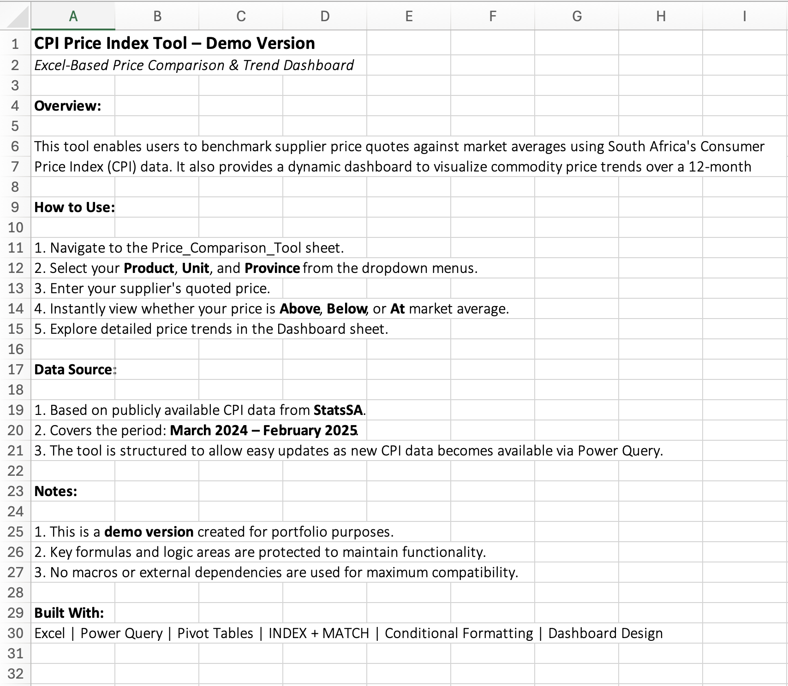
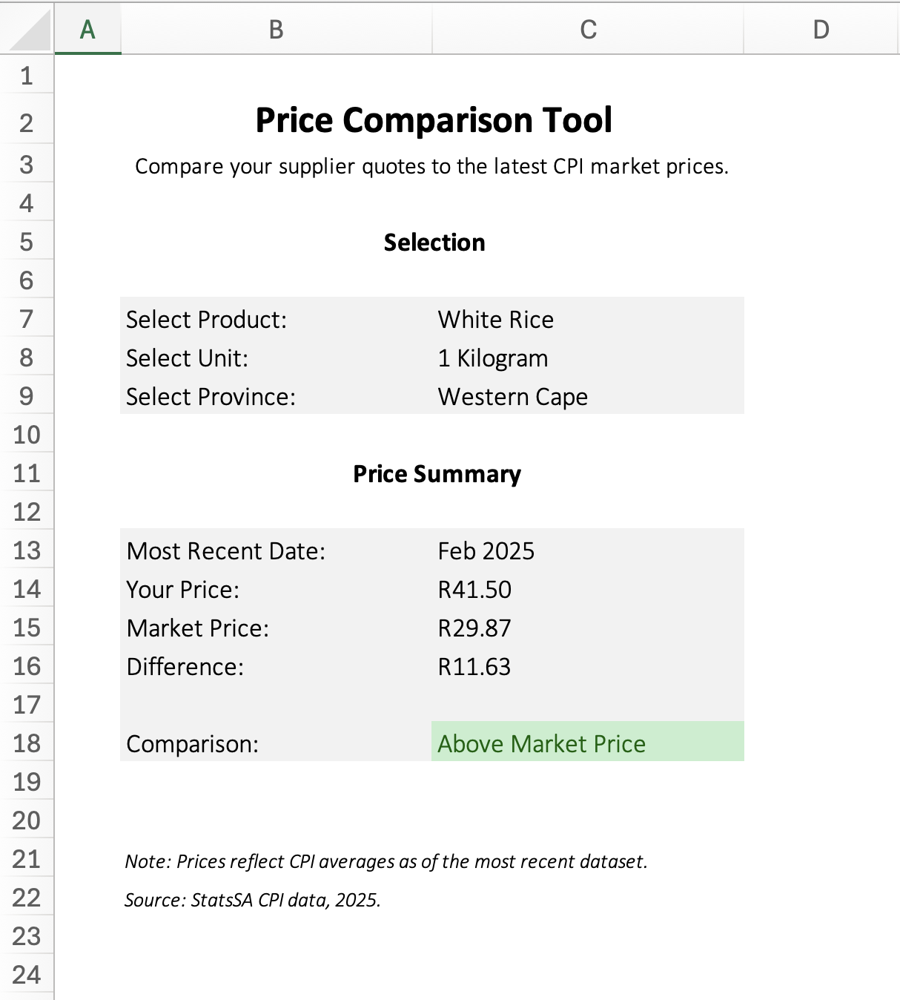
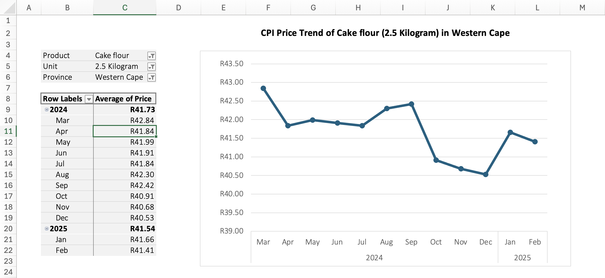

# CPI Price Index Tool 📊

A dynamic **Excel-based Price Comparison & Trend Dashboard** designed to help businesses **assess supplier pricing fairness** by benchmarking quotes against South Africa's Consumer Price Index (CPI) data, while visualising commodity price trends.

---

## Overview
This tool empowers procurement and finance teams to:
- Instantly compare supplier price quotes to the latest CPI averages
- Track commodity price trends over the past 12 months
- Make informed decisions with minimal manual effort

Built entirely in Excel using **Power Query**, **Pivot Tables**, and advanced formulas like **INDEX + MATCH**, the tool is user-friendly, refreshable, and protected against human error.

---

## ⚡ Key Features
- **Automated Data Transformation**: CPI data cleaned & structured via Power Query for easy updates
- **Multi-Criteria Lookup**: Compare prices based on Product, Unit, and Province selections
- **Interactive Dashboard**: Visualise monthly price trends with dynamic, auto-scaling charts
- **User Input Interface**: Dropdown selections, conditional formatting, and clear price difference outputs
- **No Macros Required**: Ensures smooth functionality across organisational environments without security restrictions

---

## 🛠️ Tools & Skills
`Excel` • `Power Query` • `Pivot Tables` • `INDEX + MATCH` • `Data Validation` • `Dashboard Design` • `Conditional Formatting`

---

## 🖼️ Screenshots

### 📄 Cover Sheet
  
*Overview, instructions, and data source details for using the CPI Price Index Tool.*

### 🎛️ Price Comparison Tool
  
*User selects product, inputs price, and sees instant comparison to CPI benchmark.*

### 📊 Dashboard View
  
*Dynamic trend dashboard visualising average CPI price movements over 12 months.*

---

## 💡 Business Impact
This tool was developed to address a real-world procurement challenge: enabling quick, reliable access to commodity pricing insights using CPI data. It reduces manual workload, enhances pricing transparency, and supports smarter supplier negotiations.

This solution demonstrates how Excel can be leveraged beyond basic spreadsheets — transforming public data into actionable insights that drive smarter commercial decisions.

---

## 📝 How to Use

**Designed For:** Procurement, Finance, and Operations teams needing fast, data-driven supplier price evaluations.

1. Select Product, Unit, and Province from dropdowns
2. Enter your supplier's quoted price
3. Instantly view how your quote compares to market benchmarks
4. Explore price trends in the `Dashboard` sheet

For updated CPI data, simply refresh via Power Query.

---

## 📂 Note
The dataset is based on publicly available CPI data from StatsSA.
